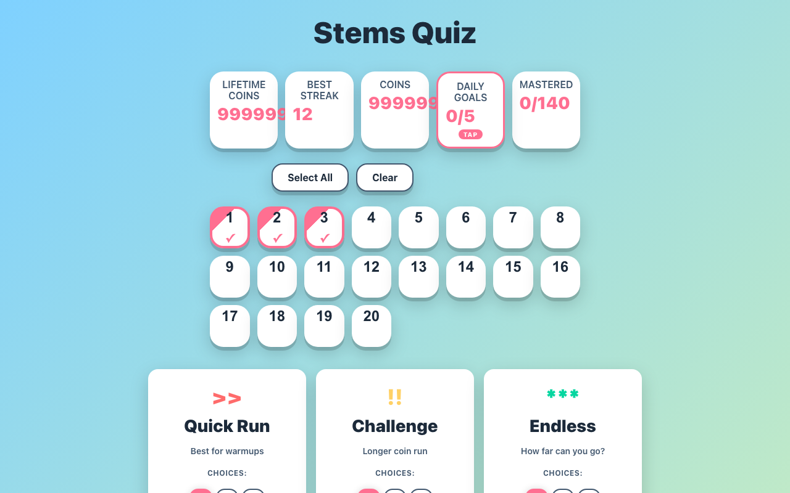
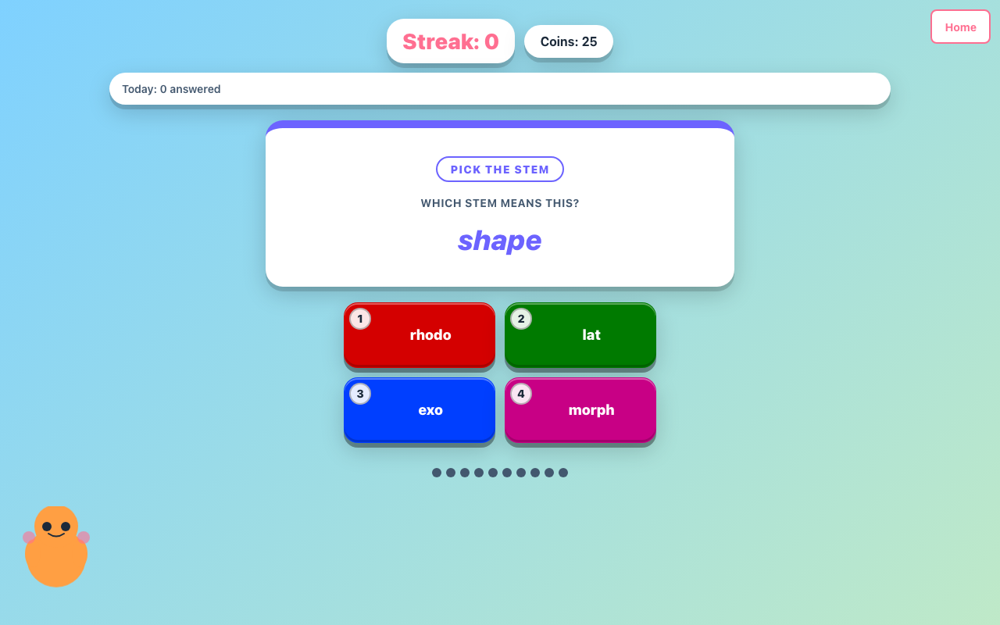
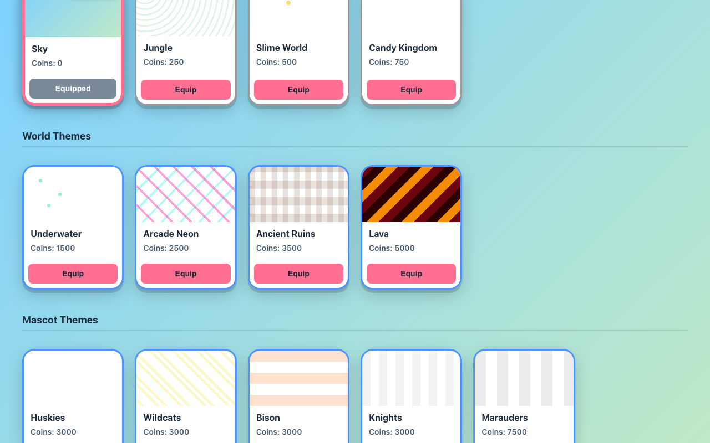

# stem-lesson-quiz-game

An arcade-style browser game that trains 140 Greek and Latin word stems across 20 lessons. Built for middle-school students learning roots, with fast play sessions, streak feedback, coin rewards, and unlockable themes, no accounts required.

Play it live: [vosslab.github.io/stem-lesson-quiz-game](https://vosslab.github.io/stem-lesson-quiz-game/)

The game runs entirely in the browser as static TypeScript. It offers three
modes: Quick Run (10 questions, 4 distractors), Challenge (25 questions, 6
distractors), and Endless (unlimited, 8 distractors). Correct answers
auto-advance; wrong answers pause on a teaching panel. See
[docs/GAME_USAGE.md](docs/GAME_USAGE.md) for full mechanics and controls.

<!-- screenshots:begin (managed by screenshot-docs) -->





<!-- screenshots:end -->

## Quick start

```bash
./setup_game.sh       # one-time: npm install + initial build
./run_web_server.sh   # build and serve on a random port (set PORT for a stable URL)
```

`run_web_server.sh` builds `dist/` and serves it locally; `PORT=8123
./run_web_server.sh` pins a stable URL. For a portable, no-server build,
`./export_single_file.sh` writes `dist-single/stems_quiz.html`. See
[docs/INSTALL.md](docs/INSTALL.md) and [docs/USAGE.md](docs/USAGE.md) for
prerequisites and the full workflow.

## Documentation

Project docs:

- [docs/GAME_USAGE.md](docs/GAME_USAGE.md): game mechanics, controls, and modes.
- [docs/INSTALL.md](docs/INSTALL.md): prerequisites and one-time setup.
- [docs/USAGE.md](docs/USAGE.md): build, run, export, and test workflows.
- [docs/CODE_ARCHITECTURE.md](docs/CODE_ARCHITECTURE.md): system design and data flow.
- [docs/FILE_STRUCTURE.md](docs/FILE_STRUCTURE.md): directory map and generated assets.
- [docs/TROUBLESHOOTING.md](docs/TROUBLESHOOTING.md): known issues and fixes.
- [docs/CHANGELOG.md](docs/CHANGELOG.md): dated record of changes to this repo.

Style and process (shared across the maintainer's repos):

- [docs/REPO_STYLE.md](docs/REPO_STYLE.md): repo organization, naming, and changelog rules.
- [docs/TYPESCRIPT_STYLE.md](docs/TYPESCRIPT_STYLE.md): TypeScript rules for the game source.
- [docs/PYTHON_STYLE.md](docs/PYTHON_STYLE.md): Python rules for the extraction pipeline.
- [docs/PYTEST_STYLE.md](docs/PYTEST_STYLE.md): pytest design and failure triage.
- [docs/E2E_TESTS.md](docs/E2E_TESTS.md): non-browser end-to-end conventions.
- [docs/PLAYWRIGHT_USAGE.md](docs/PLAYWRIGHT_USAGE.md): headless browser smoke testing.
- [docs/MARKDOWN_STYLE.md](docs/MARKDOWN_STYLE.md): Markdown formatting rules.

## Tests

```bash
pytest tests/          # fast Python pytest suite
bash check_codebase.sh # typecheck + Playwright smoke
```

Detailed test conventions live in [docs/E2E_TESTS.md](docs/E2E_TESTS.md) and
[docs/PLAYWRIGHT_USAGE.md](docs/PLAYWRIGHT_USAGE.md).
